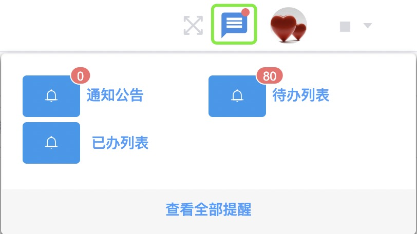
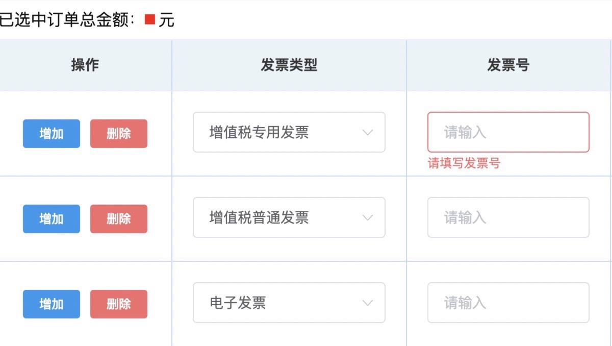

## 审批
将鼠标移动到右上角第二个小图标上，此时会显示下拉菜单。  
 
::: tip 提示
待办列表：展示自己未处理的审批。
已办列表：展示自己已经处理的审批。
:::
### 待办列表 
1. 点击菜单中的「待办列表」，跳转到<u>待办列表</u>页面。  
2. 通过选填「开始日期结束日期」/「订单号」查询，或通过左侧的审批分类，找到想审批的申请单，并点击。  
3. 按要求填写弹出的申请单后，选择「同意」/「不同意」或「驳回」。  
  
::: tip 提示
+ 选择「同意」时，申请单会流转到下一节点。  
+ 选择「不同意」时，申请单会退回到开始节点。
此时发起人可以选择 「同意」/「作废」。

作废：此次申请单取消，需重新发起申请单。

+ 选择「驳回」时，申请单会退回到上一节点。  
:::
### 已办列表
1. 点击菜单中的「已办列表」，跳转到<u>已办列表</u>页面。  
2. 通过选填「开始日期结束日期」/「订单号」查询，或通过左侧的审批分类，找到想查看的申请单，并点击。  
3. 点击<kbd>撤回</kbd>即可撤回，申请单会退回到上一节点。  
点击「流程展示」即可查看当前进度。  

::: tip 提示
只有在下一节点还未同意时，才能撤回。
:::
<!-- ### 审批进度
点击“审批状态”栏下的「审核中」或「审核通过」可以查看审批进度。
 -->
