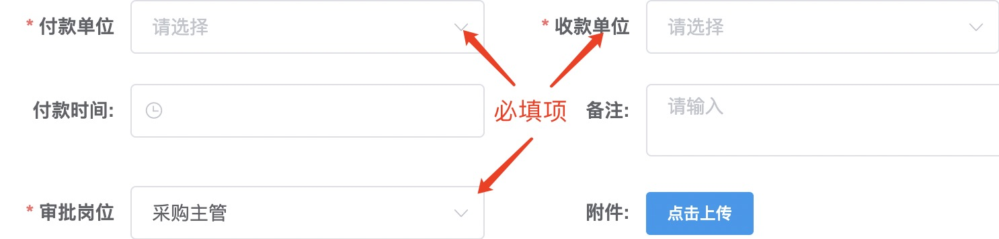
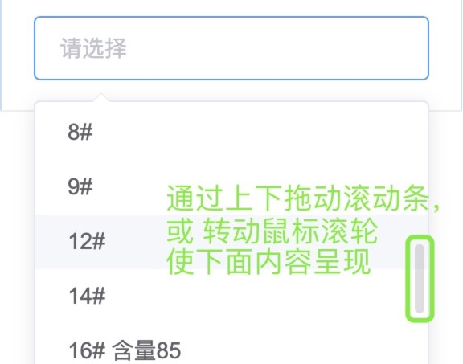
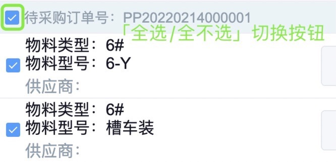
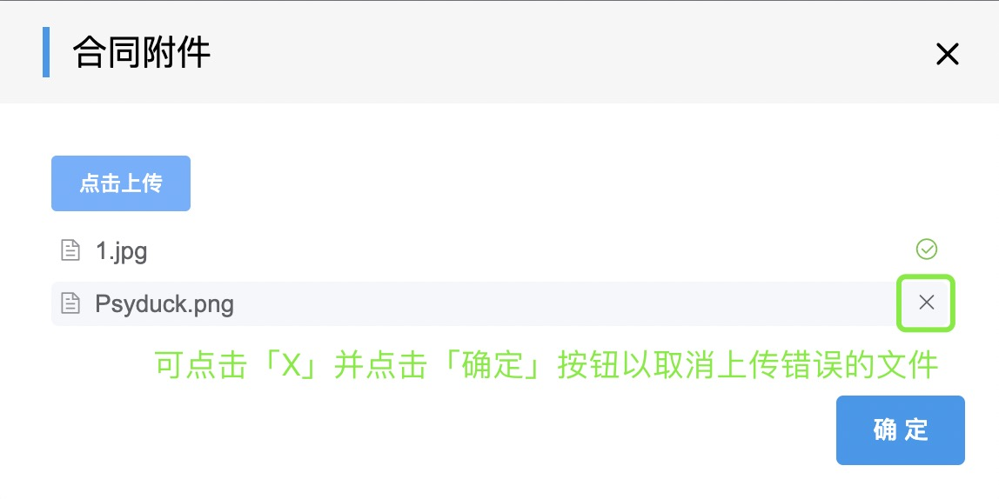
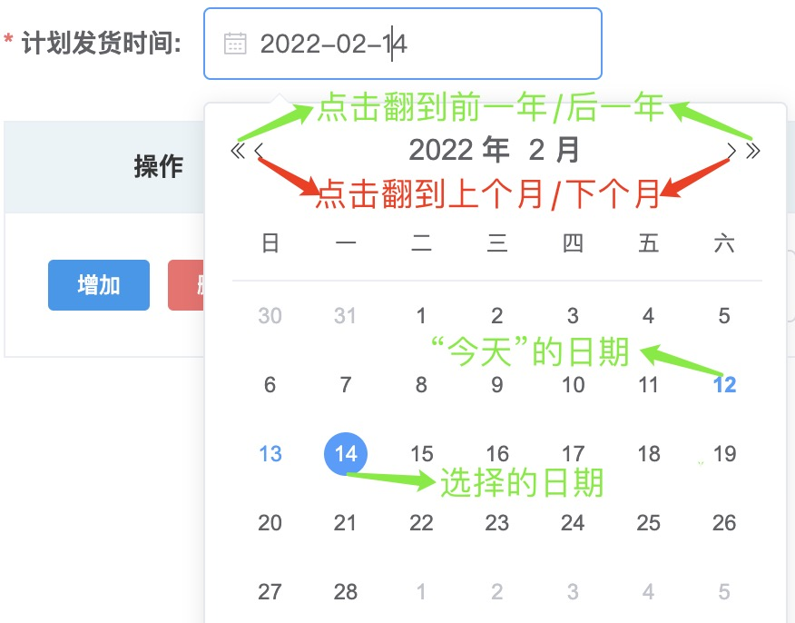
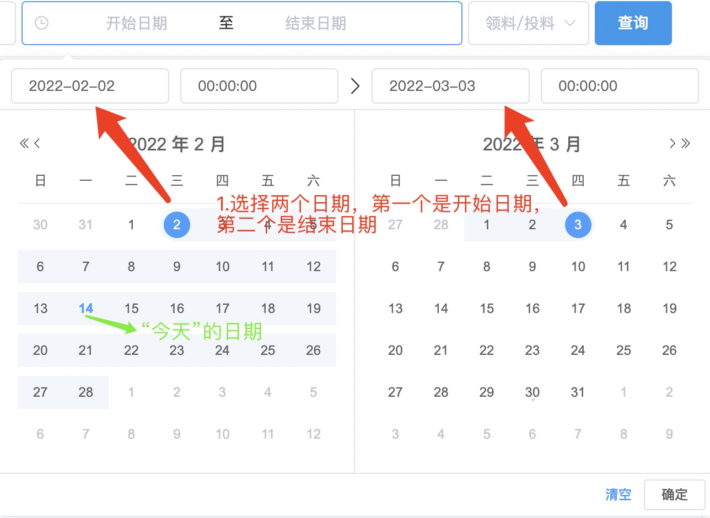
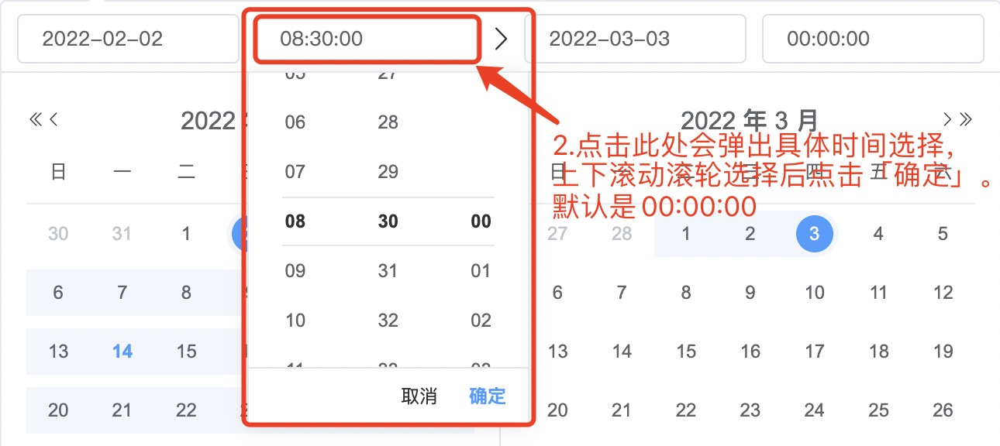

## 常见表单元素
### 规则
::: warning 提醒
填写表单时，注意前面带“*”的项为必填项，不带的为选填项。  
请按要求填写所有必填项后再提交。  
  
:::
### 常见表单元素
<table>
<thead>
<tr>
<th width="64px">表单元素</th>
<th>示例</th>
<th>操作方法</th>
</tr>
</thead>

<tbody>
<tr>
<td>文本框</td>
<td></td>
<td>点击后光标闪烁，需手动输入文本内容</td>
</tr>

<tr>
<td>下拉框</td>
<td></td>
<td>点击后弹出菜单供选择，一般只能选择其中一项</td>
</tr>

<tr>
<td>多选框</td>
<td></td>
<td>点击勾选一个或多个</td>
</tr>

<tr>
<td>文件框</td>
<td></td>
<td>点击后选择文件上传</td>
</tr>

<tr>
<td>状态开关</td>
<td></td>
<td>点击切换状态</td>
</tr>

<tr>
<td>选择日期</td>
<td></td>
<td>点击后弹出菜单，选择一个日期</td>
</tr>

<tr>
<td rowspan="2">选择开始日期和结束日期</td>
<td></td>
<td>1.先选择日期</td>
</tr>

<tr>
<td></td>
<td>2.再选择具体时间</td>
</tr>
</tbody>
</table>