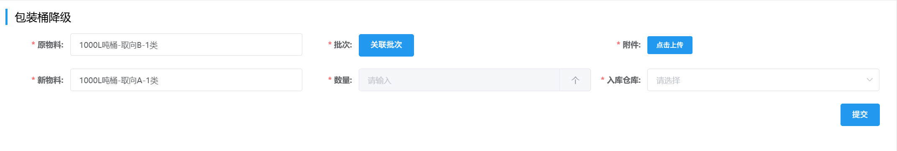

## 包装桶降级
1. 填写选择「原物料」，「新物料」和「入库仓库」。

2. 点击「关联批次」并填写对应表单，再点击<kbd>确定</kbd>，然后「上传附件」，最后点击<kbd>提交</kbd>。
 

此后进入审批流程，相关岗位可在右上角「待办列表」-「生产审批审批」-「包装降级」里完成审批。
<ShowImg src="../../.vuepress/public/images/process/bucket.png" text="点击查看“包装降级”的审批流程图"/> 