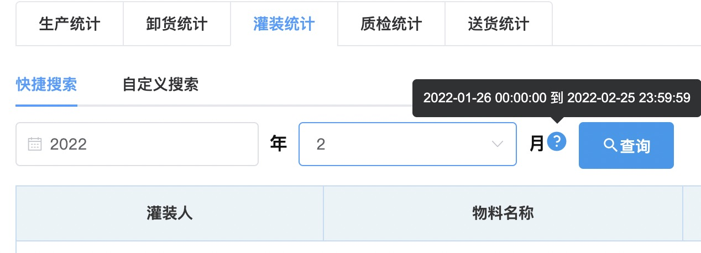
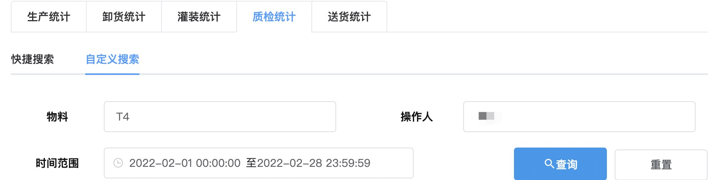

## 工作量统计
### 快捷搜索
1. 从「生产统计」/「卸货统计」/「灌装统计」/「质检统计」/「送货统计」中选择要查询的一项。  
2. 点击「快捷搜索」。  
3. 选择「年」、「月」后，点击<kbd>查询</kbd>。  
  
::: tip 提示
将鼠标移动到<kbd>?</kbd>上可显示具体日期和时间。  
:::
### 自定义搜索
1. 从「生产统计」/「卸货统计」/「灌装统计」/「质检统计」/「送货统计」中选择要查询的一项。  
2. 点击「自定义搜索」。  
3. 选填下方的任意项后，点击<kbd>查询</kbd>。  
  
>+ 点击右上角<kbd>导出</kbd>可导出查询结果。 