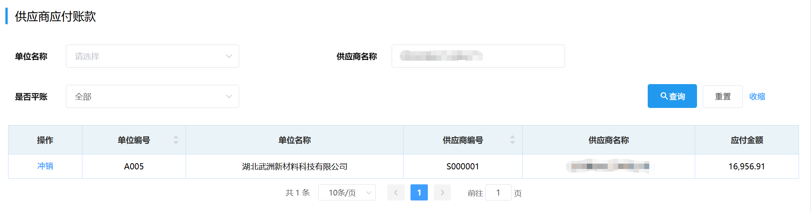
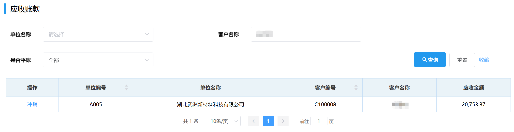

<!-- # 应收应付管理
::: tip 提示
该页面数据是根据<u>发票管理</u>页面和<u>付款管理</u>页面的金额对应汇总而来。  
:::
## 供应商应付账款
供应商应付账款可通过选填「单位名称」/「供应商名称」/「是否平账」来筛选查询。  
 
## 承运商应付账款
供应商应付账款可通过选填「单位名称」/「承运商名称」/「是否平账」来筛选查询。 
 
## 应收账款
应收账款可通过选填「单位名称」/「客户名称」/「是否平账」来筛选查询。
  
### 冲销
在<u>供应商应付账款</u>页面和<u>应收账款</u>页面的"操作"栏可进行「冲销」。 

点击"操作"栏下的<kbd>冲销</kbd>，会弹出提示是否进行冲销，点击<kbd>确定</kbd>。
::: warning 提醒
作用：将应收金额与应付金额的相同部分相抵消。

条件：此公司必须是客户也是供应商。
::: -->
