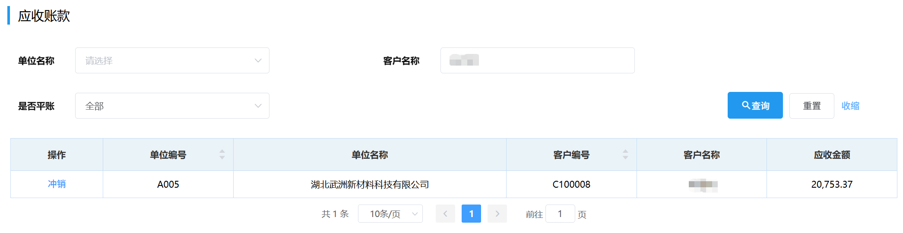

## 应收账款
应收账款可通过选填「单位名称」/「客户名称」/「是否平账」来筛选查询。
  
### 冲销
在<u>供应商应付账款</u>页面和<u>应收账款</u>页面的"操作"栏可进行「冲销」。 

点击"操作"栏下的<kbd>冲销</kbd>，会弹出提示是否进行冲销，点击<kbd>确定</kbd>。
::: warning 提醒
作用：将应收金额与应付金额的相同部分相抵消。

条件：此公司必须是客户也是供应商。
:::