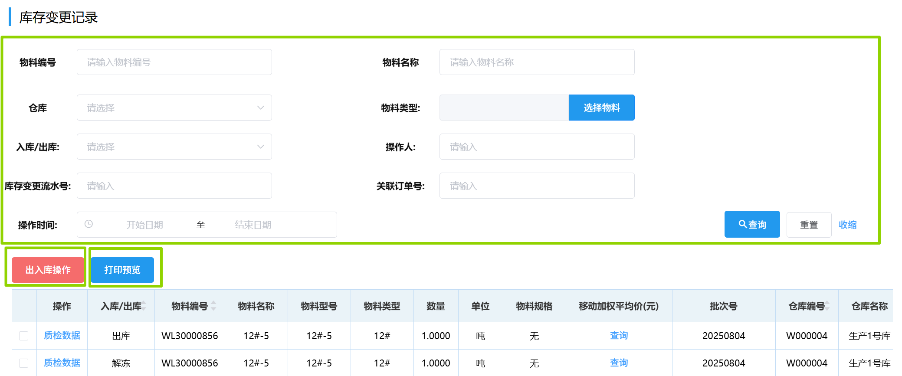
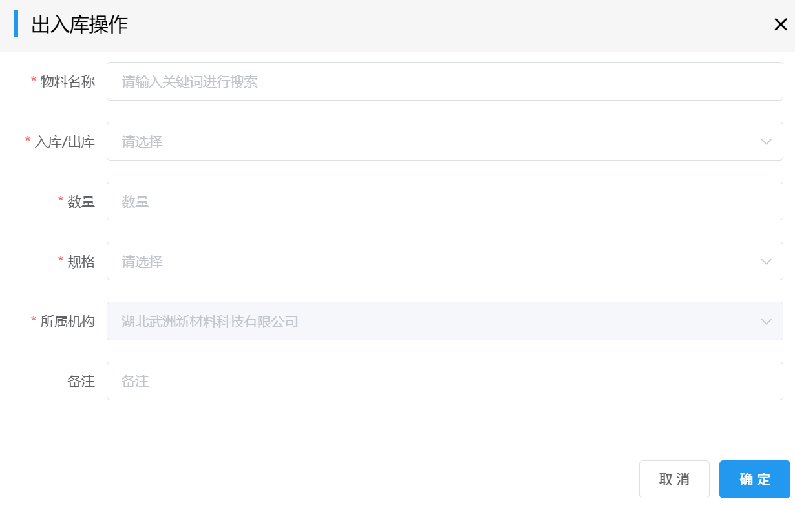
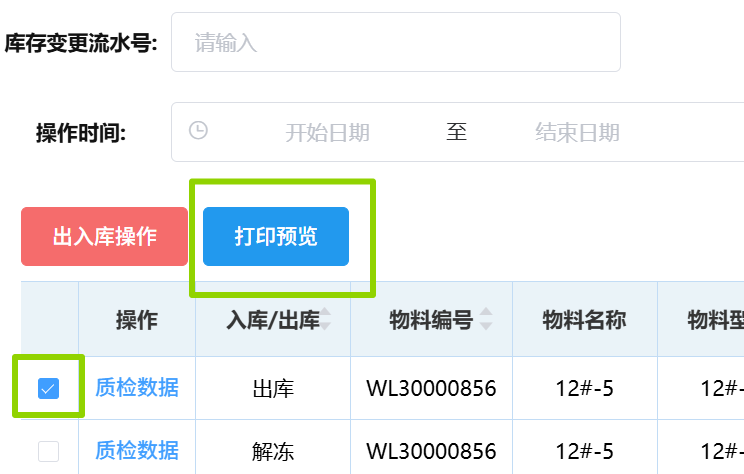
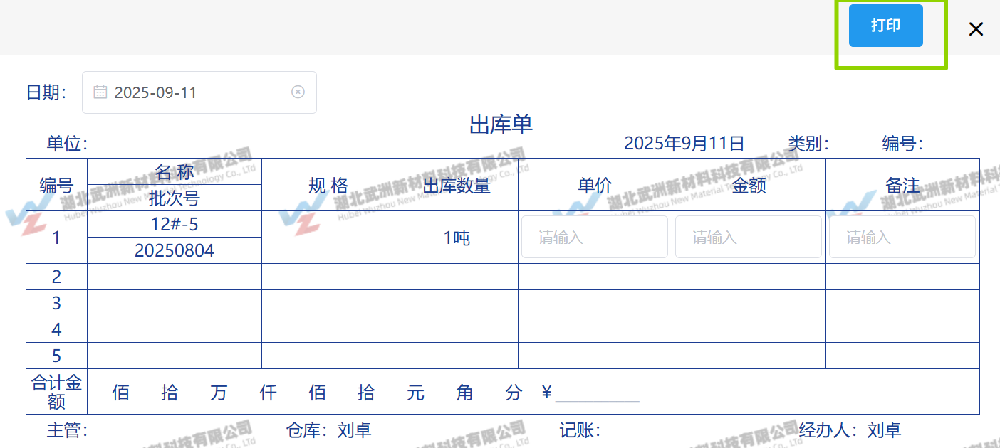

## 库存变更记录
### 查询库存变更记录
库存变更记录可通过选填「物料编号」/「物料名称」/「仓库」/「物料类别」/「入库/出库」/「操作人」/「库存变更流水号」/「关联订单号」/「操作时间」中任意项来筛选查询。
   
### 出入库操作
点击<kbd>出入库操作</kbd>会弹出“出入库操作”表单，填写相关信息后点击<kbd>确定</kbd>。 
 
此后进入审批流程，相关岗位可在右上角「待办列表」-「采购审批」-「库存操作审批」里完成审批。  
<ShowImg src="../../.vuepress/public/images/process/cg-kcczsp.png" text="“库存操作审批”的审批流程图"/>  
仓库管理员-原料库在审批时需点击<kbd>关联批次</kbd>，选择“批次号”并填写数量，点击<kbd>确定</kbd>。  

### 打印预览
可打印出库单和入库单。
1. 先勾选要打印的库存变更记录，再点击<kbd>打印预览</kbd>。
 
2. 会弹出要打印的出库单/入库单，再点击右上角的 <kbd>打印</kbd>。
 
::: warning 提醒
只能勾选一条出入库记录进行打印，否则进行如下警告：
 
:::