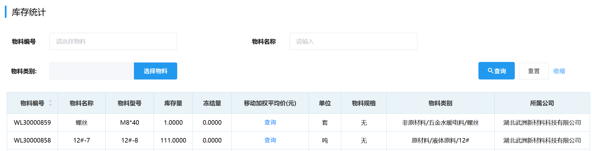
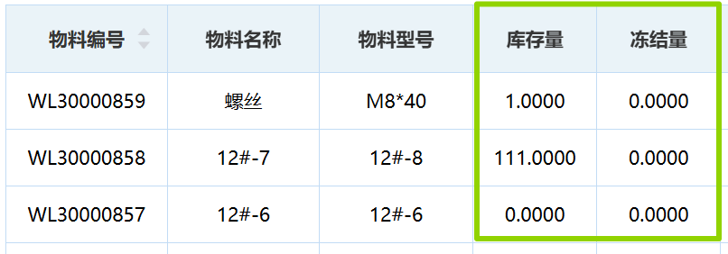

## 库存统计
库存统计可通过选填「物料编号」/「物料名称」/「物料类别」中任意项来筛选查询。
  
::: warning 提醒
如要查询某种特定物料，建议通过「物料编号」来查询，不建议通过「物料名称」来查询。  
因为精确搜索常因错别字、字母大小写、空格等得到意料之外的搜索结果。  
:::
::: tip 提示
冻结量：被冻结不能使用的量。 

被冻结的形式：备货单冻结，移库冻结和灌装冻结。

物料可自由使用的量=库存量-冻结量

合理使用页面下方的「*条/页」和排序三角形按钮可以帮助你快速找到想要的数据。  
:::