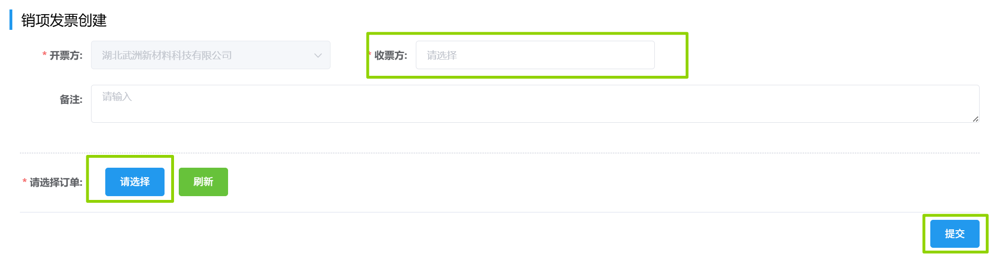

## 销项发票创建
填写「收票方」，「开票方」和「请选择订单」项，然后点击<kbd>提交</kbd>。  

此后进入审批流程，相关岗位可在右上角「待办列表」-「财务审批」-「发票录入审批」里完成审批。  
<ShowImg src="../../.vuepress/public/images/process/cw-fplrsp2.png" text="“发票录入审批”的审批流程图"/> 
会计在审批时需点击<kbd>录入发票</kbd>，填写弹出的表单，上传相关附件。 