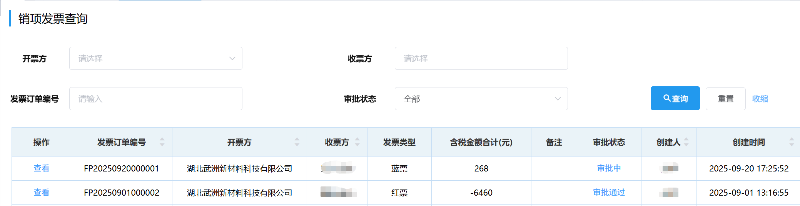
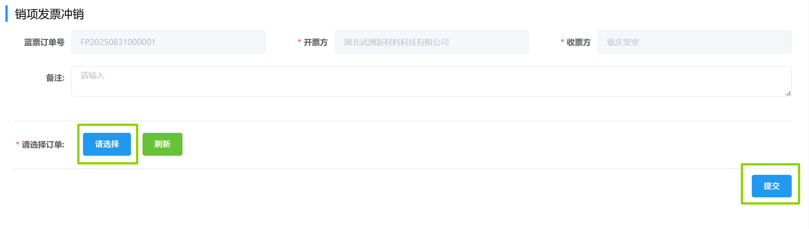
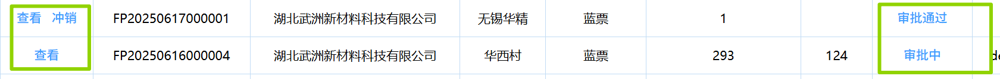

## 销项发票查询
### 查询
销项发票可通过选填「收票方」/「开票方」/「发票订单编号」/「审批状态」中任意项来筛选查询。  

### 冲销
点击「操作」列里的<kbd>冲销</kbd>，会跳转到<u>销项发票冲销</u>页面，点击<kbd>请选择</kbd>来选择要冲销的订单，然后点击<kbd>提交</kbd>。

::: warning 提醒
只有当“销项发票录入审批”完成，“操作”栏才有“冲销”按钮。

:::
此后进入审批流程，相关岗位可在右上角「待办列表」-「财务审批」-「销项发票冲红」里完成审批。
<ShowImg src="/images/process/cw-fplrsp4.png" text="“销项发票冲红”的审批流程图"/>
 会计在审批时需点击<kbd>录入销项冲红发票</kbd>，填写弹出的表单，含税金额必须要为负。
