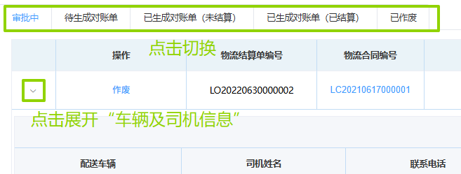
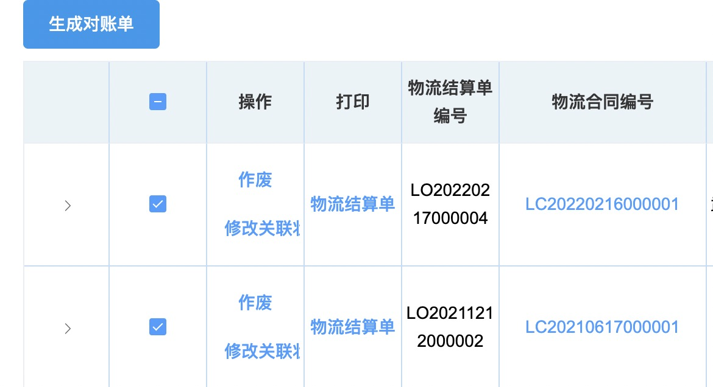

## 物流结算单查询
### 查询物流结算单
可通过选填「物流合同编号」/「合同名称」/「合同类型」/「承运商」/「生效日期」中任意项，然后点击「审批中」/「待生成对账单」/「已生成对账单（未结算）」/「已生成对账单（已结算）」来查询不同状态的结算单。  
  
### 生成对账单
1. 点击结算单状态栏的<kbd>待生成对账单</kbd>
  
2. 勾选要结算的项，然后点击<kbd>生成对账单</kbd>。  
  
::: warning 提醒
1. 所选项的“物流合同编号”要一致，否则弹出如下警告。  
  
2. 「结算类型」为“销售订单”和“采购订单”在生成对账单前必须先关联。
3. 销售回桶，销售退货和其他不用关联，但要点击<kbd>修改关联状态</kbd>。
:::
3.确认信息后，在弹出的对话框里点击<kbd>确定创建对账单</kbd>。  

此后进入审批流程，相关岗位可在右上角「待办列表」-「物流审批」-「物流对账单审批」里完成审批。  
<ShowImg src="/images/process/wl-wldzdsp.png" text="“物流对账单审批”的审批流程图"/>  

勾选的物流结算单会进入「已生成对账单（未结算）」标签页。  

<!-- 进入<u>物流发票录入</u>，<u>承运商应付账款</u>等页面付账款后，项目最后进入「已生成对账单（已结算）」标签页。   -->
### 修改关联状态
1. 找到对应物流结算单项。  
2. 点击“操作”列的「修改关联状态」。  
3. 在弹出的对话框里点击<kbd>确定</kbd>。此时“是否关联完毕”会由“是”变成“否”，或由“否”变成“是”。  
  
>+ 点击<kbd>作废</kbd>会弹出对话框，点击<kbd>确定</kbd>可使该结算单作废。 
>+ 点击”打印”栏下的<kbd>物流结算单</kbd>会弹出对话框，点击<kbd>打印</kbd>可以打印物流结算单。