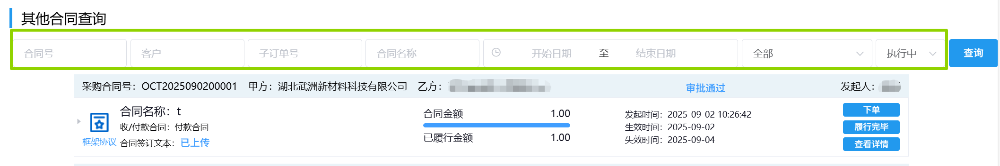
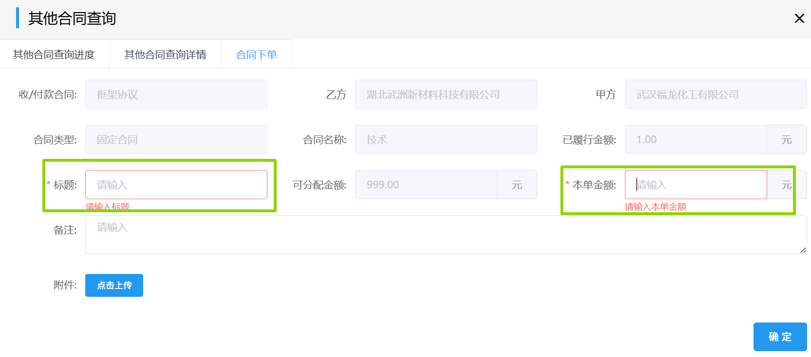
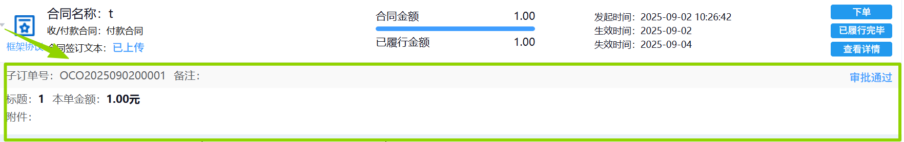
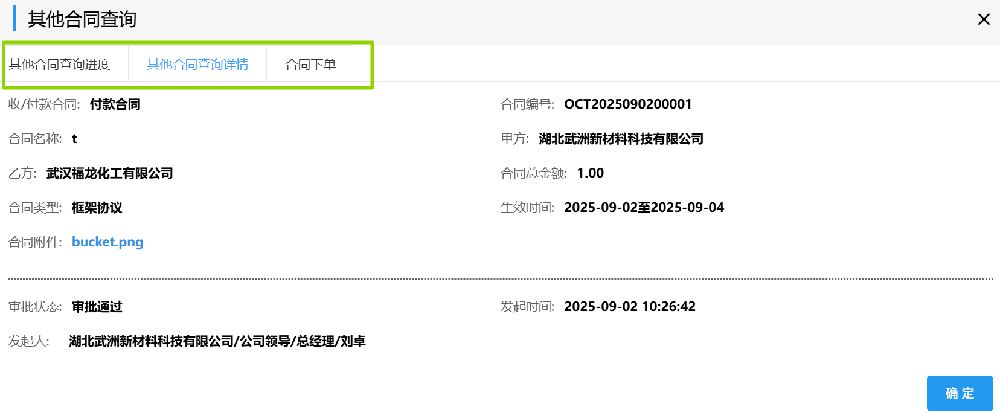
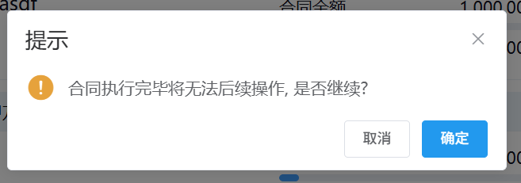

## 其他合同查询
### 查询其他合同
其他合同可通过选填「合同号」/「供方」/「子订单号」/「合同名称」/「开始日期结束日期」/「状态」中任意项来筛选查询。

### 上传
首次下单前需点击相关合同左侧的<kbd>上传</kbd>，上传相关附件。  
  
此时，左侧会变成<kbd>已上传</kbd>，右侧<kbd>下单</kbd>会变成可点击状态。 
::: tip 提示
必须上传相关附件，才能点击右侧<kbd>下单</kbd>。
:::
<!-- >+ 点击<kbd>履行完毕</kbd>，会弹出对话框，点击<kbd>确定</kbd>，此合同之后就不能进行任何操作，因此，就算完结了其他合同订单也不要点击“履行完毕”。
>+ 点击<kbd>查看详情</kbd>，会弹出对话框，点击<kbd>其他合同进度</kbd>，能查看其他合同的审批进度；点击<kbd>其他合同详情</kbd>，能查看其他合同的具体信息。  -->
### 下单（拆分成子订单）
点击<kbd>下单</kbd>，会弹出表单，输入标题和本单金额，再点击<kbd>确定</kbd>。  
 
>点击左侧的展开三角形，会显示拆分出来的子订单。
      
此后进入审批流程，相关岗位可在右上角「待办列表」-「财务审批」-「其他合同订单」里完成审批。
<ShowImg src="../../.vuepress/public/images/process/other2.png" text="“其他合同订单”的审批流程图"/>

### 查看详情
点击<kbd>查看详情</kbd>，会弹出其他合同查询对话框：
点击<kbd>其他合同查询进度</kbd>，能查看其他合同的审批进度；

点击<kbd>其他合同查询详情</kbd>，能查看其他合同的具体信息；

点击<kbd>合同下单</kbd>，能跳到<u>下单</u>界面。
  
### 履行完毕
点击<kbd>履行完毕</kbd>，会弹出提示对话框，点击<kbd>确定</kbd>。
 

此时，<kbd>履行完毕</kbd>按钮会变成<kbd>已履行完毕</kbd>，「状态」由「执行中」变为「已履行完毕」，此合同之后就不能进行任何操作。