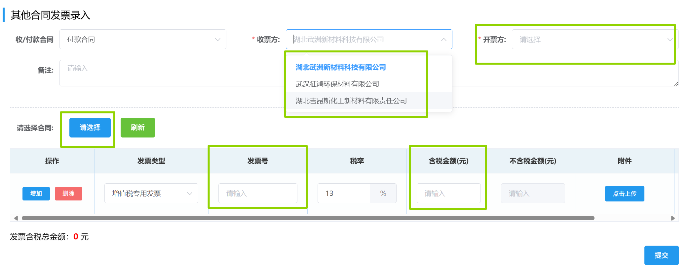

## 其他合同发票录入
1. 填写选择「收/付款合同」，「收票方」，「开票方」和「请选择合同」。  
2. 填写下方发票信息后点击<kbd>提交</kbd>。  

::: tip 提示
要先选择「收票方」和「发票方」才能「选择合同」，否则会有以下警告：

::: 
此后进入审批流程，相关岗位可在右上角「待办列表」-「财务审批」-「发票录入审批」里完成审批。 
<ShowImg src="../../.vuepress/public/images/process/other3.png" text="“发票录入审批”的审批流程图"/>