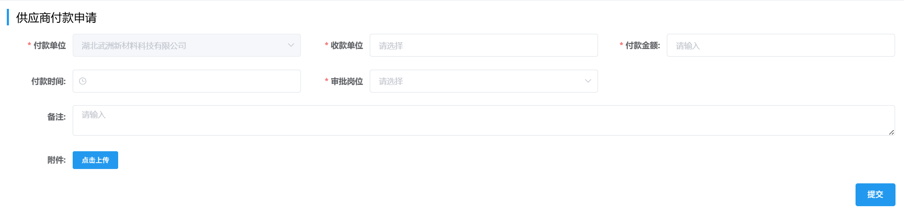
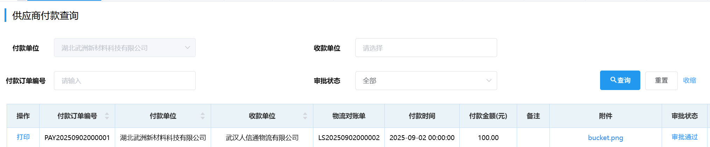
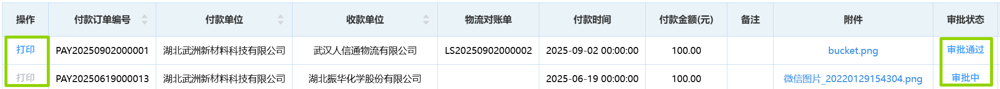
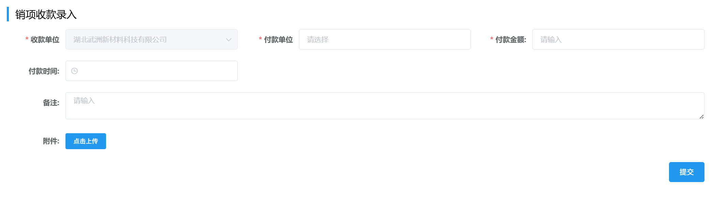
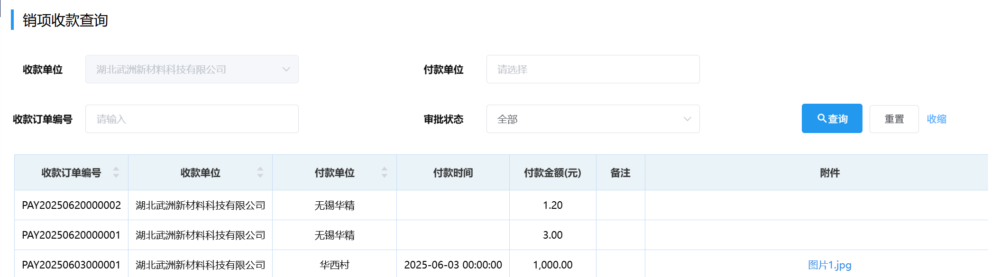

# 付款管理
## 供应商付款申请
至少填写所有前面带“*”的项，即「付款单位」，「收款单位」，「付款金额」和「审批岗位」，然后点击<kbd>提交</kbd>。 
 
此后进入审批流程，相关岗位可在右上角「待办列表」-「财务审批」-「付款录入审批」里完成审批。  
<ShowImg src="/images/process/cw-fklrsp.png" text="“付款录入审批”的审批流程图"/>  

## 供应商付款查询
### 查询
采购付款可通过选填「付款单位」/「收款单位」/「付款订单编号」/「审批状态」中任意项来筛选查询。

### 打印
当“付款录入审批”完成，“打印”按钮由灰变蓝，可点击<kbd>打印</kbd>来打印付款单，

## 销项收款录入
至少填写所有前面带“*”的项，即「收款单位」，「付款单位」和「付款金额」，然后点击<kbd>提交</kbd>。 
  
此后进入审批流程，相关岗位可在右上角「待办列表」-「财务审批」-「收款录入审批」里完成审批。  
<ShowImg src="../../.vuepress/public/images/process/cw-sklrsp.png" text="“收款录入审批”的审批流程图"/>  

## 销项收款查询
销项付款可通过选填「收款单位」/「付款单位」/「收款订单编号」/「审批状态」中任意项来筛选查询。  
 

 
