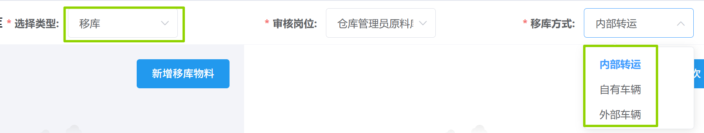
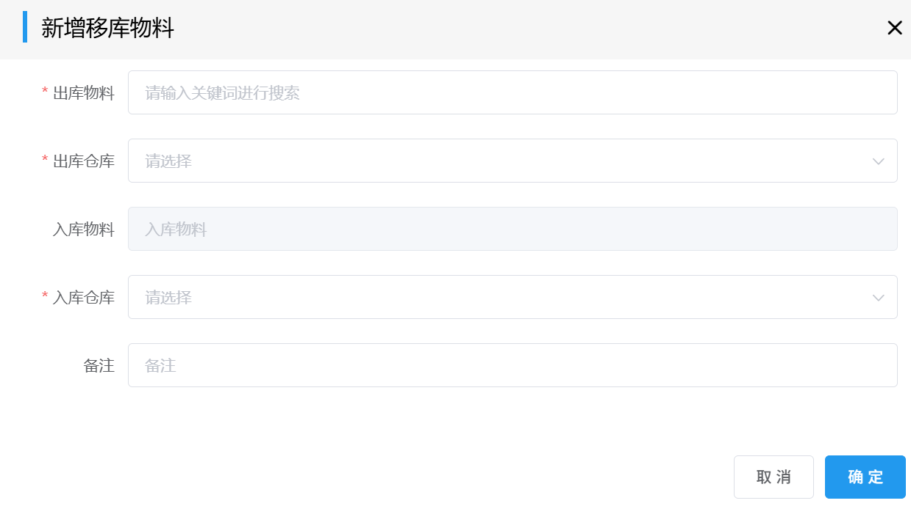
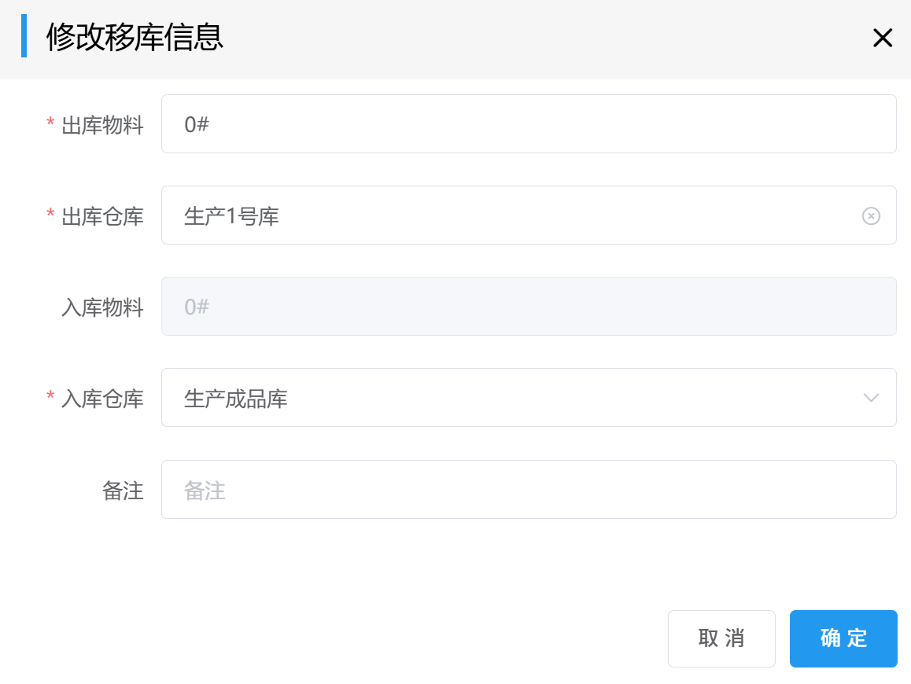
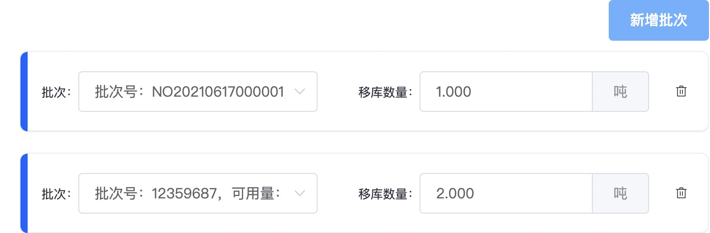
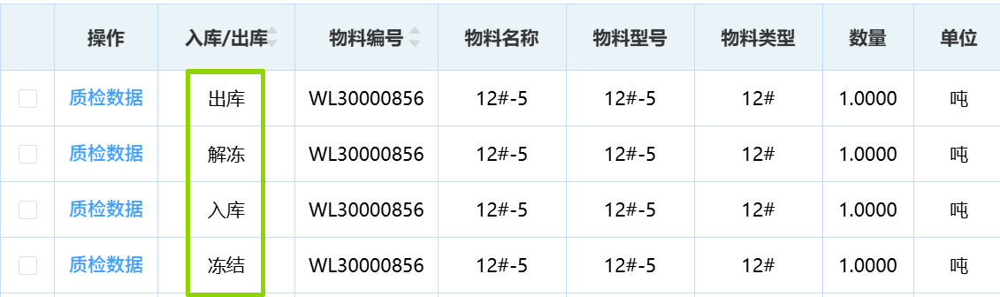
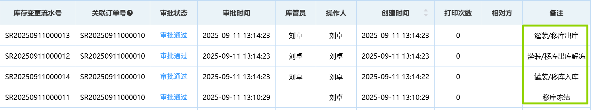
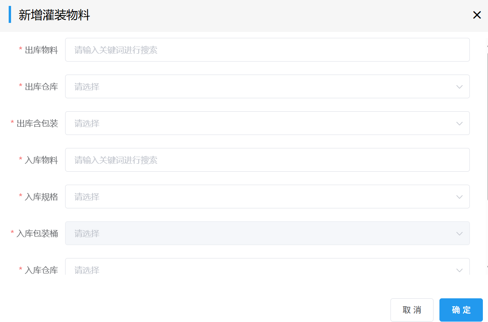
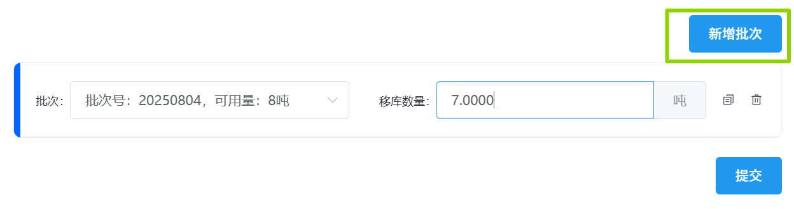

## 灌装移库
### 移库
1. 在「选择类型」中选择“移库”，填写「审核岗位」和「移库方式」。
 
2. 点击<kbd>新增移库物料</kbd>会弹出表单，填写相关信息后点击<kbd>确定</kbd>。  
 
::: warning 提醒
如果所选“出库物料”在“出库仓库”中不存在，会弹出如下警告:  
  
:::
>+ 点击右上角「...」，会出现「修改」、「删除」。  
![图片]../../.vuepress/public/images/production/gzyk2.jpg)  
>+ 可点击<kbd>修改</kbd>修改移库信息，完毕后点击<kbd>确定</kbd>。  

>+ 或者点击<kbd>删除</kbd>，然后重新「新增移库物料」。  
 

3. 选择对应的「批次」并填写「移库数量」后点击<kbd>提交</kbd>。  
>+ 可点击<kbd>新增批次</kbd>来选择多个批次的料。 
<!-- 移库数量不够时，小bug -->
  
此后进入审批流程，相关岗位可在右上角「待办列表」-「生产审批」-「灌装审批」里完成审批。  
<ShowImg src="/images/production/sc-gzsp1.png" text="“灌装审批”的审批流程图"/>   

::: details 审批要求：
1. 仓库管理员在审批时需填写「实际出入库时间」。
2. 当「移库方式」为“内部转运”时，审批不经过销售专员。
3. 当「移库方式」为“自有车辆”时，销售专员在审批时需填写「车辆」和「司机」。
4. 当「移库方式」为“外部车辆”时，销售专员在审批时需填写「物流结算单」和「结算单是否关联完毕」。  
    >若已创建好待关联的「物流结算单」未出现时，进入<u>物流结算单查询</u>页面，先点击「待生成对账单」找到对应物流结算单项，然后点击「修改关联状态」，此时“是否关联完毕”会变成“否”。最后重新进入审批页面审批。  
:::
::: tip 提示
审核完毕后，<u>库存变更记录</u>页面会出现相关变更：
1. 其“出库/入库”栏会依次增加“冻结-入库-解冻-出库”记录。
 
2. “备注”栏会依次增加“移库冻结-灌装/移库入库-灌装/移库出库解冻-灌装/移库出库”记录。 
 
:::

### 灌装
1. 在「选择类型」中选择“灌装”，填写「审核岗位」和「灌装人」。
  
2. 点击<kbd>新增灌装物料</kbd>会弹出表单，填写「出库物料」,「出库仓库」，「出库含包装」，「入库含包装」，「入库规格」，「入库包装桶」和「入库仓库」后点击<kbd>确定</kbd>。
  
3. 右侧出现批次相关信息，填写「批次」和「移库数量」后点击<kbd>提交</kbd>。 
 
::: warning 提醒
移库数量不能超过批次的可用数量，否则会弹出如下警告:
 
:::
此后进入审批流程，相关岗位可在右上角「待办列表」-「生产审批」-「灌装审批」里完成审批。  
<ShowImg src="/images/production/sc-gzsp.png" text="“灌装审批”的审批流程图"/>  
::: details 审批要求：
1. 化验员在审批时需填写「批次号」和「检验值」。
2. 仓库管理员在审批时需填写「实际出入库时间」。 
:::  
<!-- ::: tip 提示 -->
审核完毕后，<u>库存变更记录</u>页面变更情况类似”移库“环节。
<!-- ::: -->
