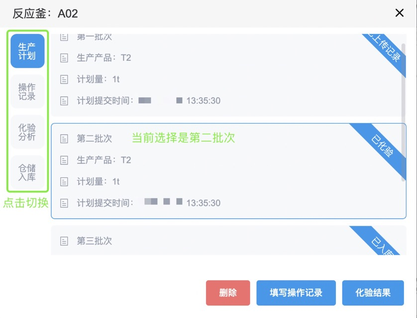
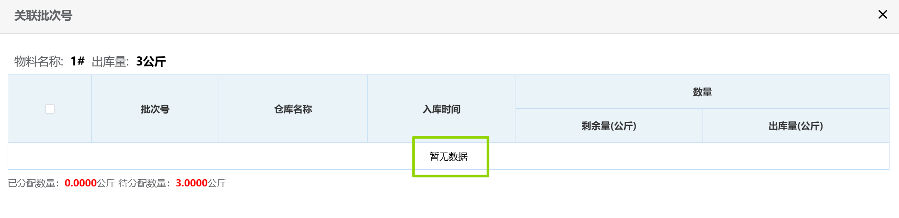

## 生产计划管理
### 备货单汇总
1. 左下方显示的是当前所有备货单中还未关联库存的物料及数量，作为录入生产计划的参考。 
2. 点击<kbd>备货单查询</kbd>能跳转到<u>备货单</u>页面查询备货单具体信息。
 
### 录入生产计划
1. 先选择“年月”，再选择“日”。被选中的具体日期会出现灰色小方框。  
  
2. 点击<kbd>录入生产计划</kbd>开始安排生产计划。  
3. 在对应位置填写“计划生产产品”和“计划生产产量”，然后点击<kbd>提交</kbd>。  
  
### 生产情况

1. 点击右侧对应的红色反应釜。  
  
2. 选择要操作的批次，如实填写对应的“操作记录”和“化验分析”并提交，之后可以“仓储入库”。  
::: tip 提示
+ 已提交操作记录的批次会显示“已上传记录”。  
+ 已提交化验结果的批次会显示“已化验”。  
+ 已提交入库申请的批次会显示“入库审批中”。  
+ 已审核入库申请的批次会显示“已入库”。  
  
:::
此后进入审批流程，相关岗位可在右上角「待办列表」-「采购审批」-「库存操作审批」里完成审批。
<ShowImg src="/images/process/sc-scllsp.png" text="“库存操作审批”的审批流程图"/>   
::: details 审批要求
仓库管理员在审批时需点击<kbd>关联批次</kbd>，勾选仓库中具体的批次并填写出库数量。 
::: warning 提醒
"关联批次"提示暂无数据，说明物料的库存不足。

:::    

::: tip 提示
审核完毕后，<u>库存变更记录</u>页面会出现相关变更。相关批次号的物料，其“出库/入库”栏会变成“入库”，“备注”栏会变成“入库/出库审批”。  
:::