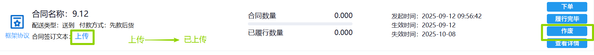
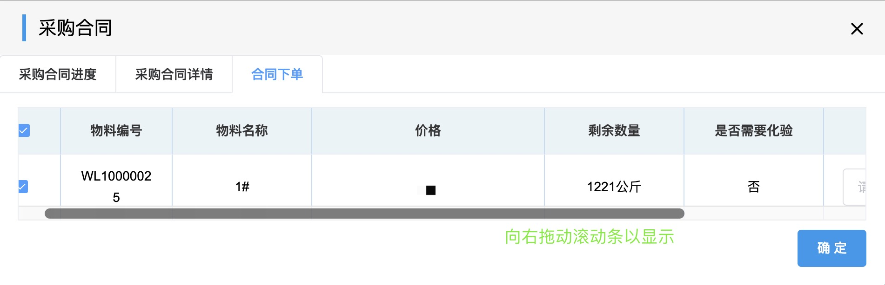
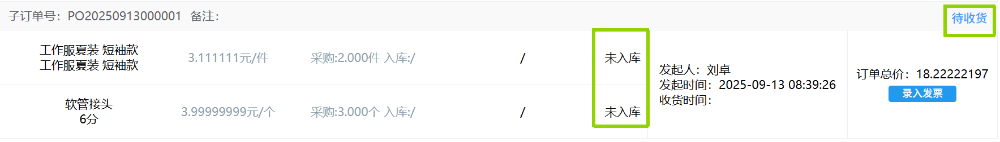
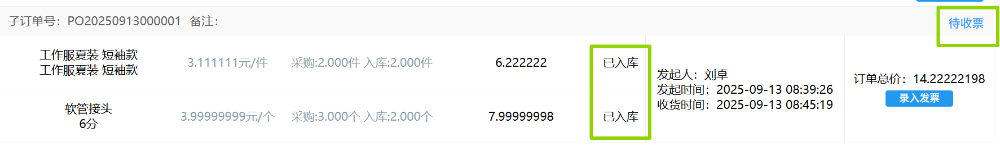
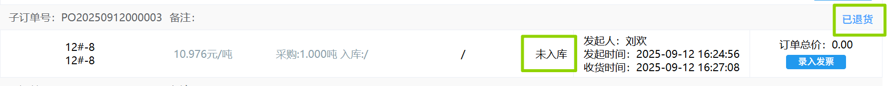
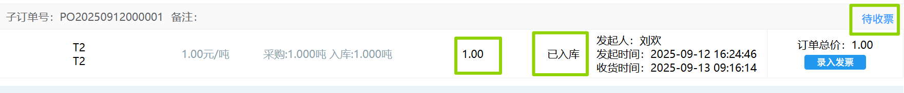
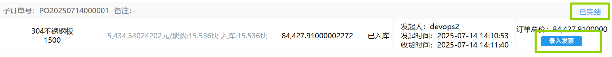

## 采购合同
### 查询采购合同
采购合同可通过选填「合同号」/「供方」/「自订单号」/「合同名称」/「开始日期结束日期」/「状态」中任意项来筛选查询。
   
### 上传
首次下单前需点击相关合同左侧的<kbd>上传</kbd>，上传相关附件。  
（合同订单需上传已签合同文本，非合同订单上传供方出库单/送货单/网购订单截图。）  
  
此时，左侧会变成<kbd>已上传</kbd>，右侧<kbd>下单</kbd>会变成深蓝色可点击状态。 
>+ 点击<kbd>作废</kbd>，会弹出对话框，填写作废原因，点击<kbd>确定</kbd>，此合同合同将不存在。 

### 下单-拆分成子订单
点击<kbd>下单</kbd>，会弹出表单，勾选本次采购的物料并填写数量（和价格）后点击<kbd>确定</kbd>。  
  
此时，在采购合同的下方会生成子订单，状态为“待收货”。
 
此后进入审批流程，相关岗位可在右上角「待办列表」-「采购审批」-「采购订单审批」里完成审批。  
<ShowImg src="/images/process/cg-cgddsp.png" text="“采购订单审批”的审批流程图"/>  

:::details 审批要求：
1. 当采购物料是原料、中间品及成品时，化验员在审批时需填写「批次号」，并上传相关附件。部分产品需要输入「检验值」并且选择<kbd>是否化验通过</kbd>。  
2. 仓库管理员-原料库在审批时需填写「入库数量」，「仓库」并上传相关附件。  
3. 当此采购合同的「送到方式」是“自提”时（之前在创建采购合同时选择的）：  
采购专员在审批时需先填写「实际送货时间」和「是否自有车辆配送」。  
  + 选择“是”时，还需填写「车辆」和「司机」。  
  + 选择“否”时，还需填写「物流结算单」和「结算单是否关联完毕」（只能选择“是”）。  
    >若已创建好待关联的「物流结算单」未出现时，进入<u>物流结算单查询</u>页面，先点击「待生成对账单」找到对应物流结算单项，然后点击「修改关联状态」，此时“是否关联完毕”会变成“否”。最后重新进入审批页面审批。  
4. 当此采购合同的「送到方式」是“送到”时，销售专员在审批时需填写「实际到货时间」。  
:::
审批完成后，采购子订单的状态会变成“待收票”。

### 退货和降等接收
只有采购物料是原料、中间品及成品，并且化验员在“采购订单审批”中选择化验不通过，才能进行“退货“和”降等接收”。

当检验结果不合格时，由总经理在审批时需选择「处理方案」。
+ 选择“退货” 后，子订单状态为“已退货”，货物状态为“未入库”。 

+ 选择“降等接收” 后，还需采购主管填写「单价」。

子订单状态变为“待收票”，货物状态为“已入库”，“单价”改变。

### 录入发票
收货完成（即审批完成）后，点击<kbd>录入发票</kbd>，进入<u>销项发票录入</u>页面。  
  
发票录入完成后，此子订单会变成“已完结”状态。  

>+ 点击<kbd>履行完毕</kbd>，会弹出对话框，点击<kbd>确定</kbd>，此后将无法继续下单操作。  
>+ 点击<kbd>查看详情</kbd>，会弹出表单，显示合同审批进度和合同内容。s