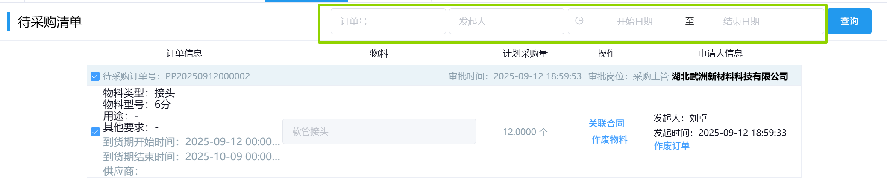
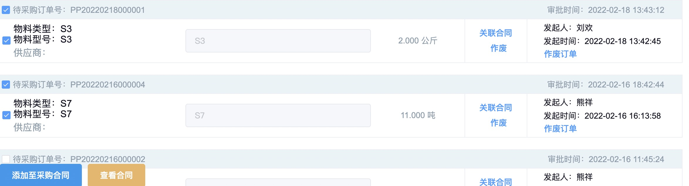
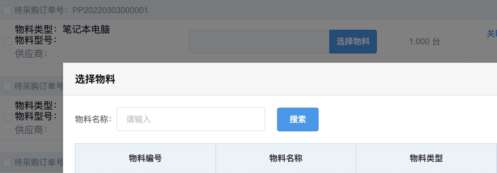
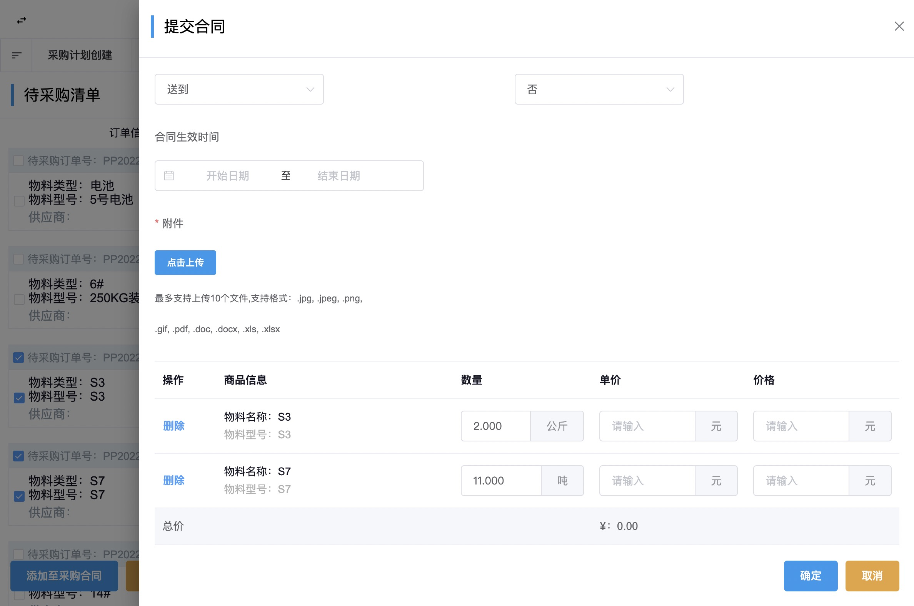
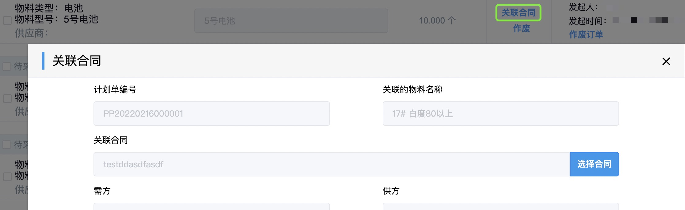
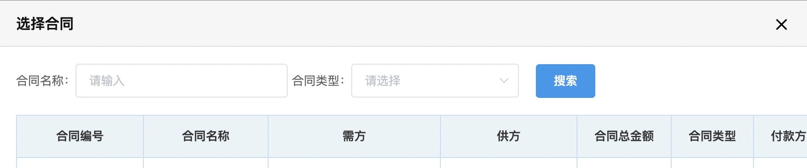

## 待采购清单
### 查询待采购清单
待采购清单可通过选填「订单号」/「发起人」/「开始日期结束日期」中任意项来筛选查询。  

### 创建采购合同
1. 勾选要添加进采购合同的项。  
  
::: warning 提醒
勾选的项必须都已选择了「物料名称」，否则弹出如下警告。  
  
应先点击<kbd>选择物料</kbd>，会弹出“选择物料”表单，然后选择「物料名称」。  
  
:::
2. 点击左下方的<kbd>添加至采购合同</kbd>。  
上方弹出如下通知栏表示操作成功。  
  
::: warning 提醒
勾选的项必须是同一种物料大类，否则弹出如下警告。  
  
:::
3. 点击左下方<kbd>查看合同</kbd>。  
4. 填写从右侧弹出的“提交合同”表单。填写相关信息后点击<kbd>确定</kbd>。  
  
::: tip 提示
1. 「合同类型」为“固定合同”和“非固定合同”时，每次购买相同物料都需要需要创建合同，再下单。
2. 「合同类型」为“非固定合同”时，不需要进行「采购合同的审批」，“提交合同”后直接生成采购合同。
3. 「合同类型」为“框架协议”时，合同里的「数量」为99999999，首次创建合同并下单后，购买相同物料，直接在创建的合同下下单，不用再创建新的合同。
:::
此后进入审批流程，相关岗位可在右上角「待办列表」-「采购审批」-「采购合同审批」里完成审批。  
<ShowImg src="../../.vuepress/public/images/process/cg-cghtsp.png" text="“采购合同审批”的审批流程图"/>  

### 关联合同
如果存在「物料名称」相同的采购合同，可以不用创建采购合同，直接关联合同。
1. 找到要添加进采购合同的项，点击后面的「关联合同」，会弹出“关联合同”表单。  
  
2. 点击表单中的<kbd>选择合同</kbd>，会弹出“选择合同”表单。
  
3. 选填表单中的「合同名称」/「合同类型」，点击<kbd>搜索</kbd>。  
4. 点击要关联的合同，然后点击<kbd>确定</kbd>。  
>+ 被关联到合同的待采购项会从待采购清单里立即移除。