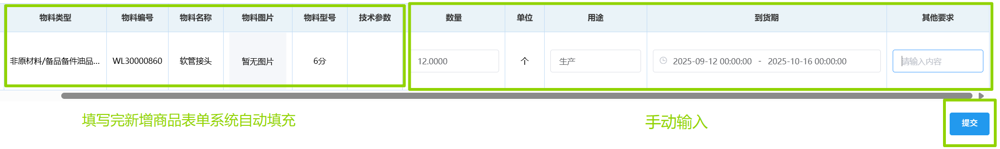

## 采购计划创建
1. 按采购制度规定选择「审核岗位」和「审核部门」。 
    
2. 填写新增表单的物料信息。

点击<kbd>新增商品</kbd>会弹出表单，输入「物料名称」后,系统会自动填充「物料类型」，「物料编号」，「物料图片」，「物料型号」和「物料技术参数」，再点击<kbd>确定</kbd>。

3. 新增的待采购项会出现在下方，填写「数量」，「用途」，「到货期」和「其他要求」后点击<kbd>提交</kbd>。 
 
>+ 点击<kbd>删除</kbd>可删除该项。  
>+ 点击<kbd>新增商品</kbd>可新增一项，从而能一次提交多个待采购项。
::: tip 提示
该表单支持模糊搜索，可输入关键字快速查找。  
  
:::
<!-- 2. 选择「物料类型」。  
点击<kbd>新增商品</kbd>会弹出表单，先点击「物料类型」后的<kbd>选择</kbd>，在新弹出的“新增商品”表单中选择物料类型，然后点击<kbd>确定</kbd>。  
::: tip 提示
该表单支持模糊搜索，可输入关键字快速查找。  
  
:::
::: warning 提醒
所选的物料类型必须是最后一级（即前面没有展开三角形的），否则弹出如下警告。  
  
:::
::: tip 提示
这一步选择的是“类型”。因此输入数字“7”不会出现“7#电池”的选项，而应该输入“电池”并选择该类型，在下一步中选择“7#电池”。  
:::
3. 选择表单中的「物料名称」并点击<kbd>确定</kbd>。  
（在未指定具体型号规格参数时，可不选择「物料名称」，之后在<u>带采购清单</u>页面选择「物料名称」）。
  
>+ 点击<kbd>新增物料</kbd>可跳转到<u>物料表</u>页面新增物料。  
（若未成功跳转，请向部门领导申请新增）。  
4. 新增的待采购项会出现在下方，填写相关信息后点击<kbd>提交</kbd>。  
>+ 点击<kbd>删除</kbd>可删除该项。  
>+ 点击<kbd>新增商品</kbd>可新增一项，从而能一次提交多个待采购项。 -->

此后进入审批流程，相关岗位可在右上角「待办列表」-「采购审批」-「采购计划审批」里完成审批。  
<ShowImg src="../../.vuepress/public/images/process/cg-cgjhsp.png" text="“采购计划审批”的审批流程图"/> 
“采购计划审批”完成后，<u>采购计划单</u>页面会增加“新增商品”的采购计划单，并且显示“审核通过”。 
 
