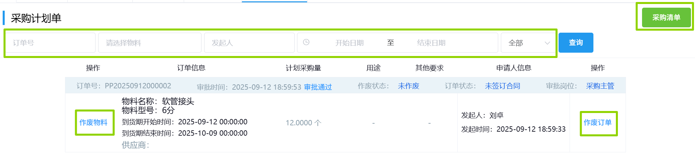

## 采购计划单
采购计划单可通过选填「订单号」/「物料」/「发起人」/「开始日期结束日期」/「状态」中任意项来筛选查询。  
 
>+ 点击左侧的「作废物料」会弹出表单，填写作废原因后点击<kbd>确认</kbd>会作废此项。  
>+ 点击右侧的「作废订单」会弹出表单，填写作废原因后点击<kbd>确认</kbd>会作废整个订单。  
>+ 点击右上角的「采购清单」可跳转到<u>待采购清单</u>页面。  
（当已签订合同时，「作废物料」/「作废订单」会变成灰色，无法点击。）