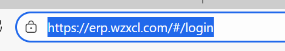
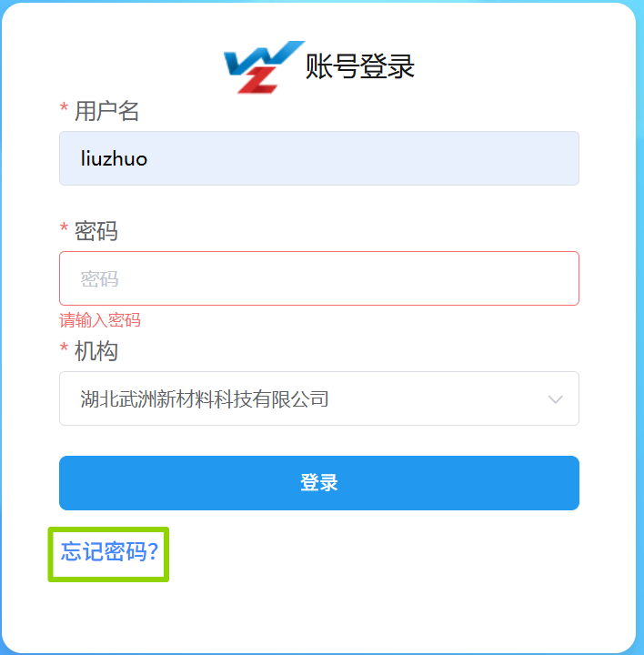
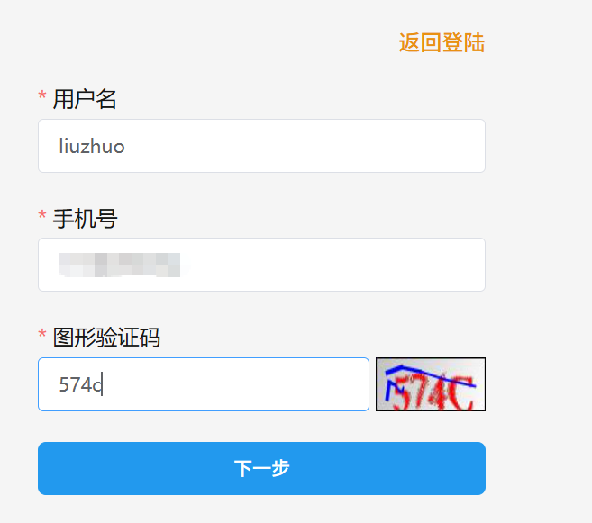
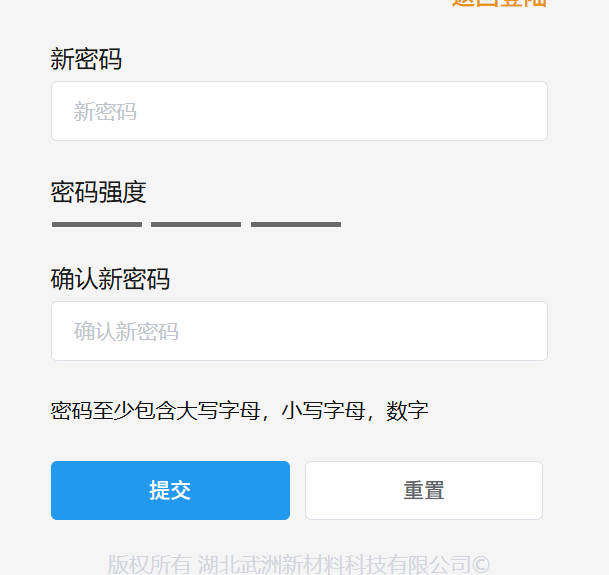
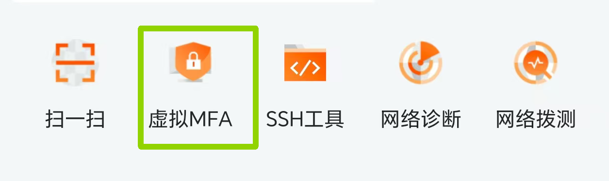
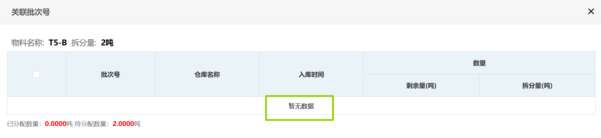
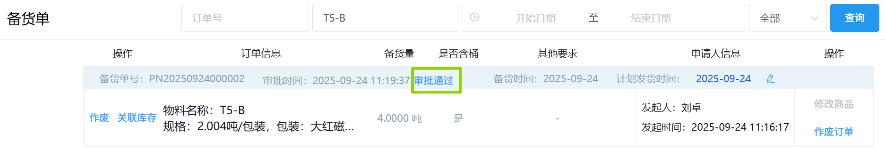
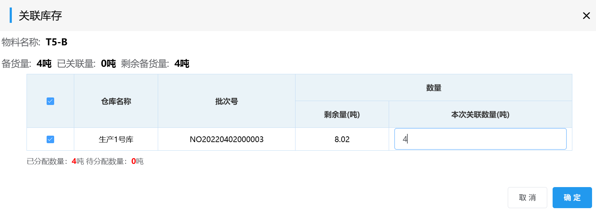
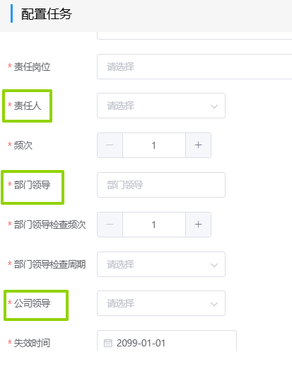

# 常见问题
## 账号注册与登录
### 注册
 1. 在浏览器的地址栏输入武洲ERP的完整网址（https://erp.wzxcl.com/#/login），再按回车键（enter），即可打开武洲ERP。

 

 2. 填写「用户名」（小写的姓名拼音），「机构」根据所属机构进行勾选，再点击<kbd>忘记密码</kbd>。
 
 3. 再依次输入「用户名」，「手机号」和「图形验证码」，点击<kbd>下一步</kbd>，再输入「短信验证码」。

 4. 设置密码，输入新密码并确认新密码，再点击<kbd>提交</kbd>,就成功注册账号。
 
 <!-- 可将网址加入收藏夹或登录时直接输入“ERP” -->
### 登录
1. 填写「用户名」和「密码」，选择「机构」，再点击<kbd>登录</kbd>。
2. 验证码输入手机阿里云app中的虚拟MFA，最后点击<kbd>登录</kbd>。

### 忘记密码
1. 登录ERP系统，点击<kbd>忘记密码</kbd>，输入「用户名」，「手机号」和「图形验证码」，点击<kbd>下一步</kbd>，再输入「短信验证码」。
2. 设置新密码，输入新密码并确认新密码，再点击<kbd>提交</kbd>,就成功设置了新密码。
3. 利用新密码进行登录。
## 库存出库
销售订单审批无法关联批次：

1. 销售必须创建备货单且审批通过。

2. 销售关联库存。

## 周期巡检
### 查看任务
必须满足的条件：
需要配置任务，用户是此任务的责任人/部门领导/公司领导。

### 删除任务
+ 没有完成过的任务： 通过删除按钮课直接删除。
+ 已完成的任务： 不能直接删除，除非修改失效日期将任务失效。

### 修改责任人
<!-- 对于没有完成的任务： -->
1. 删除任务。
<!--  -->
2. 再重新配置任务，设置新的责任人。
<!--  -->

<!-- 对于完成过的任务:
1. 修改失效日期将任务失效。
 
2. 再重新配置任务，设置新的责任人。 -->
## 审批
### 按钮区别
+ 驳回：返回审批流程的上一级。
+ 不同意：返回到审批的发起者。
+ 作废：本次审批直接取消。
### 数据填写错误
1. 下一节点还未点击"同意"。

   可在"已办"中"撤回"，再在"未办"中修改数据。

2. 下一节点已经点击“同意”。

   此时不能"撤回"。只能让下一节点“驳回”，再在未办中修改数据。
