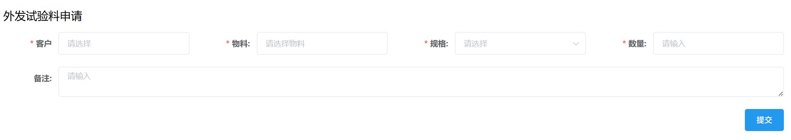

# 销售管理
## 外发试验料申请
至少填写所有前面带“*”的项，然后点击<kbd>提交</kbd>。 
  
此后进入审批流程，相关岗位可在右上角「待办列表」-「销售审批」-「外发试验料申请审批」里完成审批。  
<ShowImg src="/images/process/xs-wfsylsqsp.png" text="“外发试验料申请审批”的审批流程图"/>  

仓库管理员-原料库在审批时需点击<kbd>关联批次</kbd>，勾选仓库中具体的批次并填写数量。  