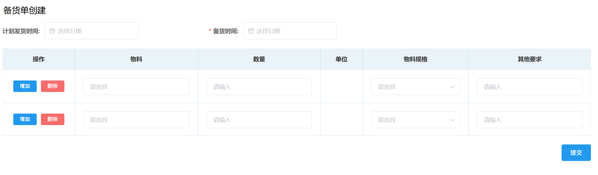

# 销售管理
## 备货单创建
1. 填写「备货时间」，选填「计划发货时间」。  
2. 填写下方的「物料」，「数量」和「物料规格」，选填「其他要求」，然后点击<kbd>提交</kbd>。
   
>+ 点击<kbd>增加</kbd>可新增一项，从而能一次提交多种物料。  

此后进入审批流程，相关岗位可在右上角「待办列表」-「销售审批」-「备货通知单审批」里完成审批。  
<ShowImg src="/images/process/xs-bhtzdsp.png" text="“备货通知单审批”的审批流程图"/>  