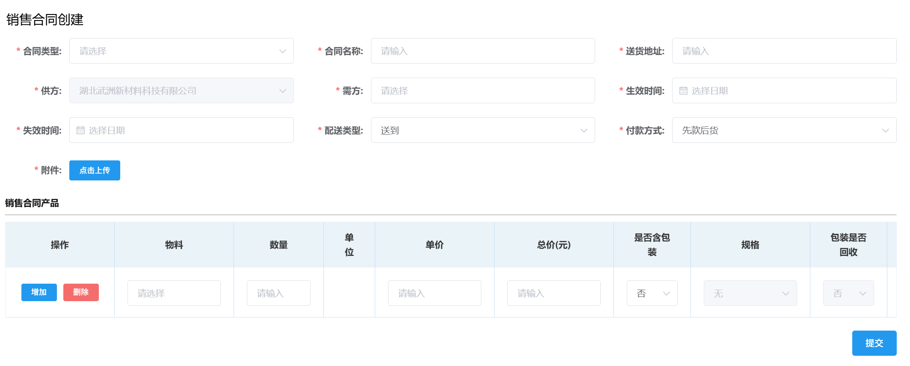

# 销售管理
## 销售合同创建
1. 填写所有前面带“*”的项，并上传相关附件。  
2. 填写下方销售合同产品信息后点击<kbd>提交</kbd>。  
 
此后进入审批流程，相关岗位可在右上角「待办列表」-「销售审批」-「销售合同审批」里完成审批。  
<ShowImg src="/images/process/xs-xshtsp.png" text="“销售合同审批”的审批流程图"/>  